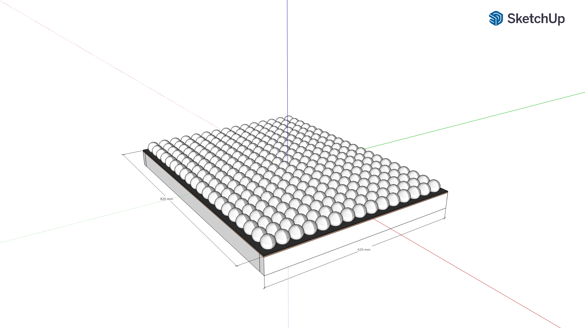
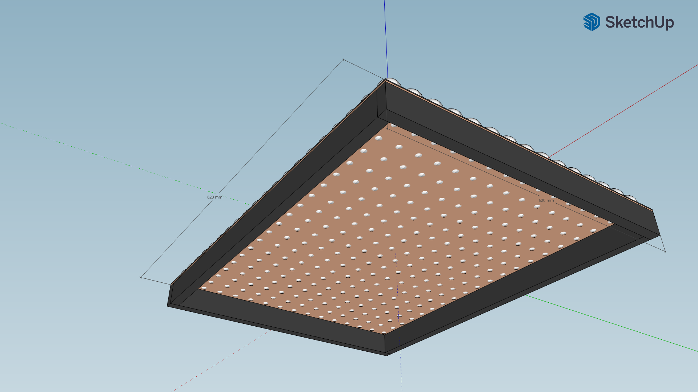

# Building and Construction of the PingPongLedWall
Here you will see the building of the Led Wall.
This is highly inspired by [bitluni's Ping Pong Led Wall](https://www.youtube.com/watch?v=fz2QAV9z_o8)

Products:

2x 150pcs 38mm Ping Pong Balls [link](https://www.amazon.de/Forfar-150Stk-Bälle-Praxis-Tischtennis/dp/B074X1CNPZ?th=1)  
6x 5v 12mm led WS2811 (50 lights) [link](https://www.amazon.de/WS2811-Pixels-digital-Addressable-String/dp/B00MXW054Y)  
1x Raspberry Pi 4 [link](https://www.amazon.de/Raspberry-Pi-ARM-Cortex-A72-Bluetooth-Micro-HDMI/dp/B07TC2BK1X)  
1x power adapter 5V 150W 30A [link](https://www.amazon.de/HAILI-Universal-Schaltnetzteil-CCTV-Kamera-LED-Streifenlicht/dp/B07Q2VPPL1/r)  
Wood for the frame and background  

Here you can see a raw idea of how the panel should look like:

I used a milling machine to get some circles into the wood. With these circles I were able to lock the balls into place. In bitluni's version they seemed to have various spacing which i did not like.
The balls have a diameter of about 38mm. I placed them 40mm apart.
I painted the wood with black so that the background looks better in daylight.

Electronics:

Connect all LEDs into a row with the given connector.
Connect the middle (data) lane (probably green) to the GPIO18 PIN (pin# 12) on the RaspberryPi with a jumper cable.
Power all LED strips seperately with the power supply (in parallel)
You can simply run the 'main.py' (you may have to execute it from the root directory of this repository for some things to work properly)
In your router you have to open port 8942 (you can change this in connection.py) for the raspberry.
type 'ifconfig' in your raspberry console and get your ip.
You can load the app or run it from this repository and connect to the given ip address of the raspberry.
Done
