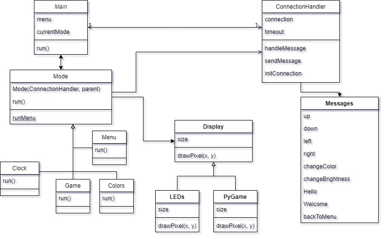

# Documentation
The codebase is quite simple and very modular.
You can simply add your own displaying modes and use the underlying display functions.

There is a simulation mode using pygame. This is very useful to experiment and test displaying options without having to connect a real led stripe-matrix.
Simply change the instantiated object in the Raspberry_Code/main file.

Here's a Class Diagram of the Raspberry_Code

The controll app is made with flutter.